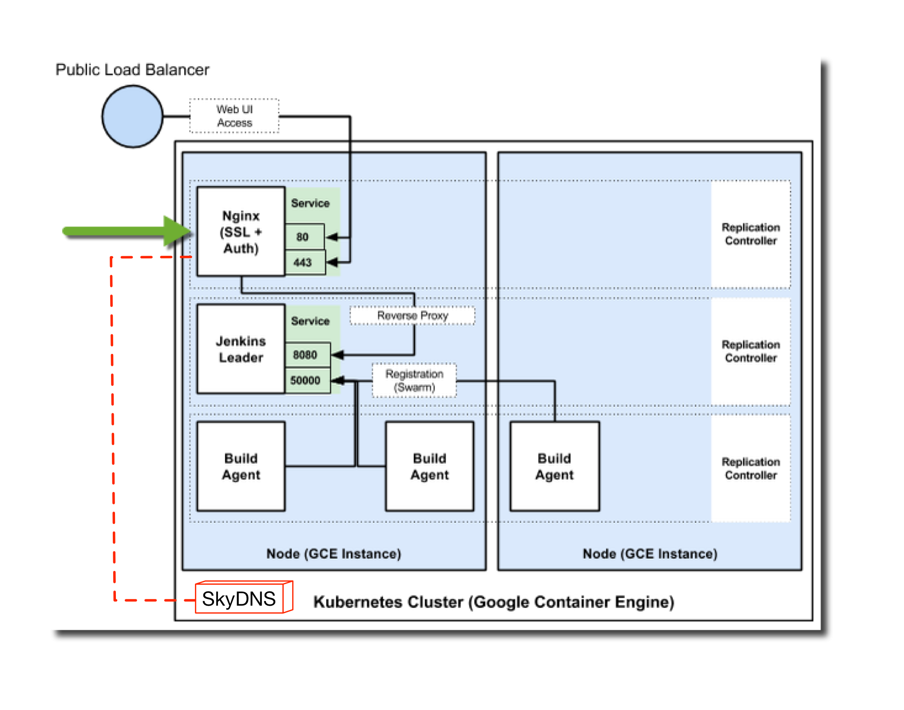

## What is k8s-nginx-proxy?
k8s-nginx-proxy is an "applicance" to use Nginx as a reverse-proxy for Kubernetes [Services](https://github.com/kubernetes/kubernetes/blob/master/docs/user-guide/services.md) in the way it was meant to be done in K8s: via DNS.

It creates a K8s configuration template for a [Secret](http://kubernetes.io/v1.0/docs/user-guide/secrets.html) based on environmental variables you define for your Nginx configuration.

The Secret configures the environmental varibles as a script that is base64
encoded and can then be loaded into a Pod image via a [Volume](http://kubernetes.io/v1.0/docs/user-guide/volumes.html) for reference & utilization.

This Secret, when sourced in the image, houses the necessary input needed to configure our custom [Nginx Pod](https://quay.io/metral/k8s-nginx-proxy) to use the [DNS resolver module](http://nginx.org/en/docs/http/ngx_http_core_module.html#resolver) that references K8s' [SkyDNS](https://github.com/kubernetes/kubernetes/tree/master/cluster/addons/dns) entries and enables a reverse-proxy for Services which auto-updates the servers it's balancing.

## Why would you want to use this?
For starters, K8s Services are basically simple load-balancers for Pods in the K8s ecosystem - they provide a single choke point / abstraction to 1+ pods for communication, and thats about it.

K8s Services are really only meant to be internally consumable within a Kubernetes cluster, so they natively do not provide the advanced capabilties we expect for an external-facing app (i.e Pods in the K8s world) such as reverse-proxying, SSL-termination, caching etc. - features that become very relevant when you take notice of the ephemeral-ness of a Pod's lifecycle, particularly, when Pods start inter-depending on one another for functionality and their communcation information is constantly changing due to rollouts, growth/scaling & failure.

k8s-nginx-proxy is modeled after and is a mix of both [GoogleCloudPlatform/nginx-ssl-proxy](https://github.com/GoogleCloudPlatform/nginx-ssl-proxy)
and [New Relic's Monitoring Agent](https://github.com/kubernetes/kubernetes/tree/master/examples/newrelic), but with the DNS twist rather than relying on static configuration - this is a key differentiator as Nginx only issues a DNS lookup for the FQDN it is proxying to when it first loads, so if the Service gets deleted or updated, Nginx would not be able to properly resolve the record unless it is tied to a DNS. This is what we aim to solve with k8s-nginx-proxy.

## Ok, so what does this architecture look like & how can I use it?
Docker Image: [quay.io/metral/k8s-nginx-proxy](https://quay.io/metral/k8s-nginx-proxy)  

This image is an enhancement of a borrowed image from [GoogleCloudPlatform/nginx-ssl-proxy](https://github.com/GoogleCloudPlatform/nginx-ssl-proxy). As its original, it is optimized for use in a Kubernetes cluster, with the added benefit of consuming SkyDNS entries for Services.

**Note: The k8s-nginx-proxy Docker image is only usable in a Kubernetes cluster enabled with SkyDNS.**


## Alright, how do I use k8s-nginx-proxy?

1. **Instantiate a K8s Service (for the sake of showcasing an example)**

  **Note**: If you already have an existing Service you wish to test on, you can
  skip this step and adapt the rest of the instructions to your liking.

  What is the purpose of an Nginx reverse-proxy without a Service to proxy on?
  So lets kick off an easy & familiar one, albeit not a fully complete instantiation, but it gets
  the job done: the `frontend` component of the Kubernetes guestbook example:

  * Create the ReplicationController for the `frontend`
  ```sh
  curl -sKS -L https://raw.githubusercontent.com/kubernetes/kubernetes/release-1.0/examples/guestbook/frontend-controller.yaml | kubectl create -f -
  ```
  * Create the Service for the `frontend`
  ```sh
  curl -sKS -L https://raw.githubusercontent.com/kubernetes/kubernetes/release-1.0/examples/guestbook/frontend-service.yaml | kubectl create -f -
  ```

2. **Create your Nginx Configuration**

  We will bootstrap our configuration via environmental variables stored in a
  K8s Secret.
  
  **Note:** Secrets are the only way of dynamically supplying a Pod
  with runtime-configurable settings that don't require the modification of pre-existing K8s templates you may have. Though you can embed the environment variables into a K8s template directly, its cleaner to decouple the settings from the foundational basis that the ReplicationController or Service instantiate in their templates.


  Here we supply the generator with the relevant information we need to pass to
  our Nginx config:

  ```sh
  ./config-to-secret.sh
  Usage: ./config-to-secret.sh <K8S_SERVICE_NAME> <K8S_NAMESPACE> <K8S_DOMAIN>
  <K8S_DNS_HOST> <NGINX_PORT>

  i.e.:
  ./config-to-secret.sh frontend default kube.local 10.1.0.10 80
  ```

  Where the parameters are:

  * **K8S_SERVICE_NAME** - Name of K8s Service that will sit behind the Nginx
  reverse-proxy
  * **K8S_NAMESPACE** - K8s Namespace where the Service lives. This is used to create the FQDN of the Service that Nginx will refer to via SkyDNS. The default namespace is called *'default'*.
  * **K8S_DOMAIN** - K8s SkyDNS domain. This is set to whichever domain you
  used when configuring `kube2sky` and `skydns`.
  * **K8S_DNS_HOST** - K8s host address of SkyDNS
  * **NGINX_PORT** - External port that Nginx will be reverse proxying for on
  behalf of the Service it represents

  Once the `config-to-secret.sh` script completes, it will create a few files for you:

  * **nginx.env** - Script which exports the environmental variables holding our Nginx data
    * i.e.
    ```sh
    export K8S_SERVICE_NAME=frontend
    export K8S_SERVICE_FQDN=frontend.default.svc.kube.local
    export K8S_DNS_HOST=10.1.0.10
    export NGINX_PORT=80
    ```
  * **nginx-env.yaml** - K8s Secret template which holds the base64 encoded data of the settings in `nginx.env`; thus, nginx.env is useless after this step
    * i.e.
    ```yaml
    apiVersion: v1
    kind: Secret
    metadata:
      name: nginx-env
    type: Opaque
    data:
      config: ZXhwb3J0IEs4U19TRVJWSUNFX05BTUU9ZnJvbnRlbmQKZXhwb3J0IEs4U19TRVJWSUNFX0ZRRE49ZnJvbnRlbmQuZGVmYXVsdC5zdmMua3ViZS5sb2NhbApleHBvcnQgSzhTX0ROU19IT1NUPTEwLjEuMC4xMApleHBvcnQgTkdJTlhfUE9SVD04MAo=
    ```

3. **Create the K8s Secret**:

  With the newly generated `nginx-env.yaml` we provide this to K8s to
  instantiate a new Secret:

  ```sh
  kubectl create -f nginx-env.yaml
  ```

4. **Create an Nginx reverse-proxy for the `frontend` Service**:

   We will create a **new** ReplicationController & Service that consumes the newly created `nginx-env` K8s Secret, which we will call the `frontend-proxy` (to differ from the `frontend`).

   For the sake of time & showcasing how you would utilize the K8s Secret, we've provided a
   template for the `frontend-proxy` in the this repo's
   `examples/frontend-proxy` directory.

   **Note**: If you wish to create your own reverse-proxy, use the [quay.io/metral/k8s-nginx-proxy](https://quay.io/metral/k8s-nginx-proxy)
   Docker image as used in `examples/frontend-proxy/frontend-proxy-rc.yaml` that
   comes ready to consume a `/etc/nginx-env/config` as shown in
   [start.sh](https://github.com/metral/k8s-nginx-proxy/blob/master/start.sh#L18-L23). **Again, this image is only usable in a Kubernetes cluster enabled with SkyDNS.**

   * Create the ReplicationController for the `frontend-proxy`
   ```sh
   kubectl create -f examples/frontend-proxy/frontend-proxy-rc.yaml
   ```
   * Create the Service for the `frontend-proxy`
   ```sh
   kubectl create -f examples/frontend-proxy/frontend-proxy-svc.yaml
   ```

5. **Test out the Nginx reverse-proxy**:
  1.  Lets create a simple `busybox` Pod to use as a test environment using the
following contents in the file `busybox.yaml`:
      ```yaml
      apiVersion: v1
      kind: Pod
      metadata:
        name: busybox
        namespace: default
      spec:
        containers:
        - image: odise/busybox-curl
          command:
            - sleep
            - "3600"
          imagePullPolicy: IfNotPresent
          name: busybox
        restartPolicy: Always
      ```

  2. Then create the Pod using the file:
    ```sh
    kubectl create -f busybox.yaml
    ```

  3. Once the Pod gets put into a running state, validate that you can hit both the guestbook `frontend` Service as well as the `frontend-proxy` reverse-proxy Service we just created:

    * Check for the `frontend` service
     ```sh
     kubectl exec busybox -- curl frontend
     ```
    * Check for the `frontend-proxy` service
     ```sh
     kubectl exec busybox -- curl frontend-proxy
     ```
    * Check for the `frontend-proxy` service using the FQDN in SkyDNS
     ```sh
     kubectl exec busybox -- curl frontend-proxy.default.svc.kube.local
     ```

    All should return the same exact HTML output expected from the `frontend` component in the guestbook example, incl. the `frontend-proxy` and `frontend-proxy.default.svc.kube.local` as they both map to the same record in SkyDNS.

    **Note**: Though not immediately trivial, you may be asking yourself what then is the
    need of this Nginx reverse-proxy if I can just hit the `frontend` node directly as
    it is also stored in SkyDNS in addition to the `frontend-proxy`. Yes, this is true, but remember the limitations of
    the K8s Services - though they can be configured to be externally
    consumable, they're really intended for internal usage, they lack robustness, and cannot: serve as an app firewall, perform
    SSL-termination, distribute load to other geographically dispersed K8s clusters, cache content, or 
    provide the other various uses of [reverse-proxies](https://en.wikipedia.org/wiki/Reverse_proxy). 
    Not to mention, that utilizing Nginx in front of Services makes for a cleaner, more abstract conceptualization and implementation of the infrastructure as you scale out.

  4. For even further testing, lets delete the guestbook `frontend`
     ReplicationController & Service, and re-create it to show that the
     `frontend-proxy` still successfully updates to the new `frontend` Service
     automatically without any work on our end:

    * Delete the `frontend` Service
     ```sh
     kubectl delete svc frontend
     ```
    * Delete the `frontend` ReplicationController
     ```sh
     kubectl delete rc frontend
     ```
    * Curl the `frontend-proxy` service using the FQDN
     ```sh
     kubectl exec busybox -- curl frontend-proxy.default.svc.kube.local
     ```
     This should return a `HTTP 502: Bad Gateway` error as the `frontend`
     Service we reverse-proxy to in `frontend-proxy` no longer resolves to anything.

     Now to show that the `frontend-proxy` is properly configured:

    * Re-create the ReplicationController for the `frontend`
    ```sh
    curl -sKS -L https://raw.githubusercontent.com/kubernetes/kubernetes/release-1.0/examples/guestbook/frontend-controller.yaml | kubectl create -f -
    ```
    * Re-create the Service for the `frontend`
    ```sh
    curl -sKS -L https://raw.githubusercontent.com/kubernetes/kubernetes/release-1.0/examples/guestbook/frontend-service.yaml | kubectl create -f -
    ```
    * Now curl the `frontend-proxy` service once more using the FQDN
     ```sh
     kubectl exec busybox -- curl frontend-proxy.default.svc.kube.local
     ```
     The `frontend-proxy` should resolve automatically to the new `frontend` Service and output
     the correct, expected output with no updates on our part.

## Wrap-Up
So lets review what we accomplished here:

* We have a K8s Service we want to reverse-proxy to so that it is properly
configured for external access.
* We create a runtime-configured K8s Secret that is used by the [quay.io/metral/k8s-nginx-proxy](https://quay.io/metral/k8s-nginx-proxy) Docker image that:
  * Sources the K8s Secret's contents
  * Creates an Nginx confg for a reverse-proxy based on the contents
  * Automatically updates the servers it proxies utilizing SkyDNS entries
  * Allows us to further enable features such as SSL-termination & caching -
  features that are *not* inherent to K8s Services

## Misc
* As an alternative, in K8s v1.1, there is a new, native, beta resource in K8s known as [Ingress](http://kubernetes.io/v1.1/docs/user-guide/ingress.html).
  * Ingress is a collection of network rules that allow inbound connections to reach
cluster Services as well as enable "externally-reachable urls, load balance
traffic, terminate SSL, offer name based virtual hosting etc." 

## Potential TODO List
* Currently, only support for an HTTP Nginx reverse-proxy exists; thus HTTPS/TLS support is needed.
* The `config-to-secret.sh` script and in turn, the [quay.io/metral/k8s-nginx-proxy](https://quay.io/metral/k8s-nginx-proxy) image, is
pretty basic in the configuration it can generate for Nginx. Further
enhancements and best practice settings should be integrated.
* ???
